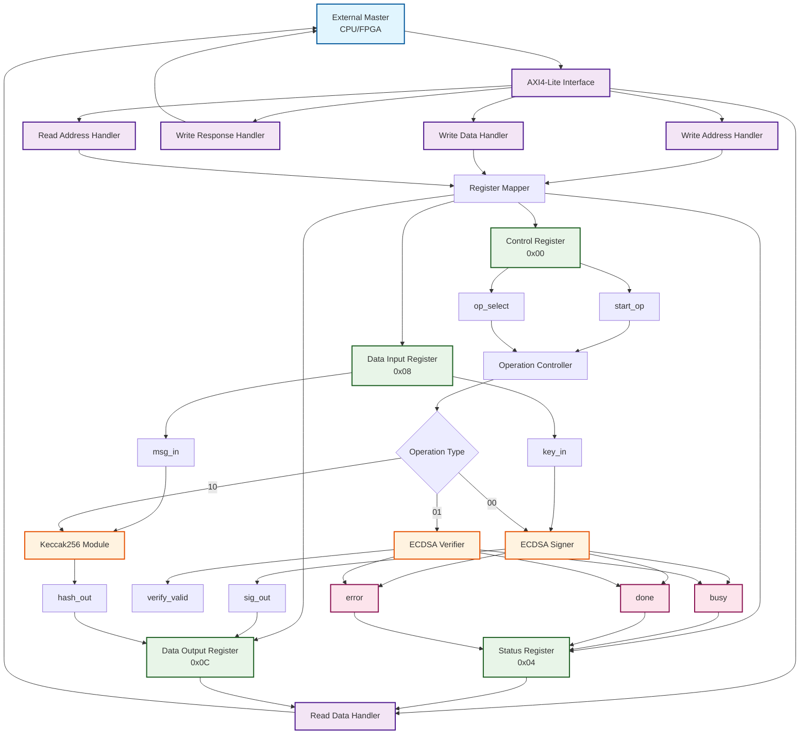
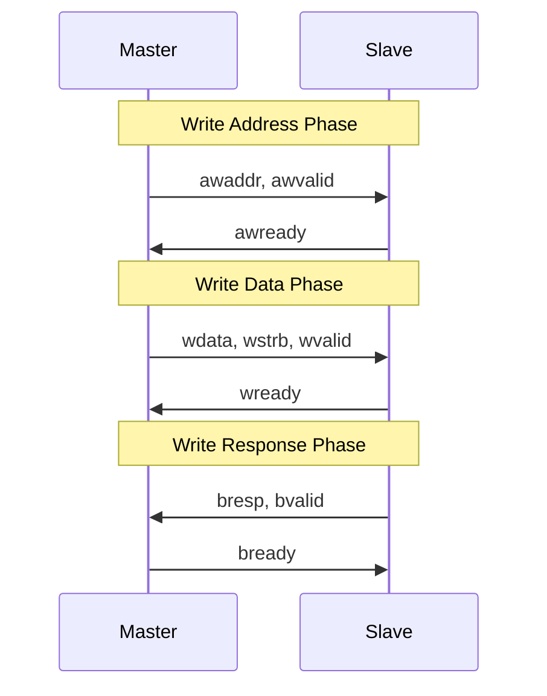
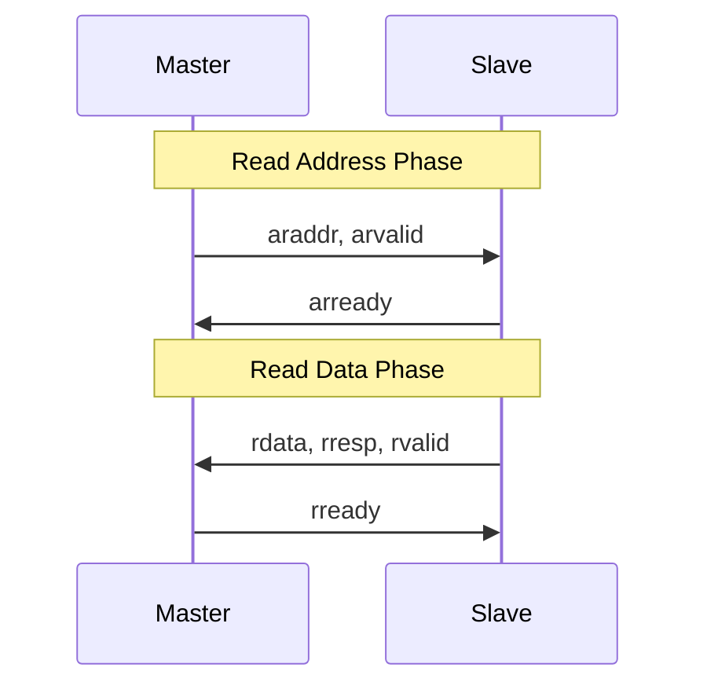

# AXI4 Interface Dataflow Diagram
## Virtual Chip Signature System

## Text-Based Dataflow Diagram

```
┌─────────────────────────────────────────────────────────────────────────────────┐
│                           EXTERNAL MASTER (CPU/FPGA)                            │
│                                                                                 │
│  ┌─────────────┐    ┌─────────────┐    ┌─────────────┐    ┌─────────────┐       │
│  │   WRITE     │    │   READ      │    │   STATUS    │    │   CONTROL   │       │
│  │  REQUEST    │    │  REQUEST    │    │   CHECK     │    │   COMMAND   │       │
│  └─────────────┘    └─────────────┘    └─────────────┘    └─────────────┘       │
│         │                   │                   │                   │           │
│         ▼                   ▼                   ▼                   ▼           │
│  ┌─────────────┐    ┌─────────────┐    ┌─────────────┐    ┌─────────────┐       │
│  │  AXI4-Lite  │    │  AXI4-Lite  │    │  AXI4-Lite  │    │  AXI4-Lite  │       │
│  │   WRITE     │    │    READ     │    │    READ     │    │   WRITE     │       │
│  │  CHANNELS   │    │   CHANNELS  │    │   CHANNELS  │    │  CHANNELS   │       │
│  └─────────────┘    └─────────────┘    └─────────────┘    └─────────────┘       │
└─────────────────────────────────────────────────────────────────────────────────┘
                                    │
                                    ▼
┌─────────────────────────────────────────────────────────────────────────────────┐
│                           AXI4-LITE SLAVE INTERFACE                             │
│                                                                                 │
│  ┌─────────────────────────────────────────────────────────────────────────┐    │
│  │                    AXI_Interface Module                                 │    │
│  │                                                                         │    │
│  │  ┌─────────────────┐  ┌─────────────────┐  ┌─────────────────┐          │    │
│  │  │   WRITE ADDR    │  │   WRITE DATA    │  │   WRITE RESP    │          │    │
│  │  │   HANDLER       │  │   HANDLER       │  │   HANDLER       │          │    │
│  │  │                 │  │                 │  │                 │          │    │
│  │  │ • awaddr[3:0]   │  │ • wdata[31:0]   │  │ • bresp[1:0]    │          │    │
│  │  │ • awvalid       │  │ • wstrb[3:0]    │  │ • bvalid        │          │    │
│  │  │ • awready       │  │ • wvalid        │  │ • bready        │          │    │
│  │  │                 │  │ • wready        │  │                 │          │    │
│  │  └─────────────────┘  └─────────────────┘  └─────────────────┘          │    │
│  │                                                                         │    │
│  │  ┌─────────────────┐  ┌─────────────────┐  ┌─────────────────┐          │    │
│  │  │   READ ADDR     │  │   READ DATA     │  │   REGISTER      │          │    │
│  │  │   HANDLER       │  │   HANDLER       │  │   MAPPER        │          │    │
│  │  │                 │  │                 │  │                 │          │    │
│  │  │ • araddr[3:0]   │  │ • rdata[31:0]   │  │ • reg_control   │          │    │
│  │  │ • arvalid       │  │ • rresp[1:0]    │  │ • reg_status    │          │    │
│  │  │ • arready       │  │ • rvalid        │  │ • reg_data_in   │          │    │
│  │  │                 │  │ • rready        │  │ • reg_data_out  │          │    │
│  │  └─────────────────┘  └─────────────────┘  └─────────────────┘          │    │
│  └─────────────────────────────────────────────────────────────────────────┘    │
└─────────────────────────────────────────────────────────────────────────────────┘
                                    │
                                    ▼
┌─────────────────────────────────────────────────────────────────────────────────┐
│                           REGISTER MAP (16 BYTES)                               │
│                                                                                 │
│  ┌─────────────┐  ┌─────────────┐  ┌─────────────┐  ┌─────────────┐             │
│  │   0x00      │  │   0x04      │  │   0x08      │  │   0x0C      │             │
│  │  CONTROL    │  │   STATUS    │  │ DATA INPUT  │  │ DATA OUTPUT │             │
│  │  REGISTER   │  │  REGISTER   │  │  REGISTER   │  │  REGISTER   │             │
│  │             │  │             │  │             │  │             │             │
│  │ [31:3] = 0  │  │ [31:3] = 0  │  │ [31:0] =    │  │ [31:0] =    │             │
│  │ [2:1] =     │  │ [2] = error │  │ msg_in[31:0]│  │ sig_out[31:0]│            │
│  │ op_select   │  │ [1] = done  │  │             │  │             │             │
│  │ [0] = start │  │ [0] = busy  │  │             │  │             │             │
│  └─────────────┘  └─────────────┘  └─────────────┘  └─────────────┘             │
└─────────────────────────────────────────────────────────────────────────────────┘
                                    │
                                    ▼
┌─────────────────────────────────────────────────────────────────────────────────┐
│                        INTERNAL CONTROL SIGNALS                                 │
│                                                                                 │
│  ┌─────────────┐  ┌─────────────┐  ┌─────────────┐  ┌─────────────┐             │
│  │   start_op  │  │  op_select  │  │   msg_in    │  │   key_in    │             │
│  │   (1-bit)   │  │   (2-bit)   │  │  (256-bit)  │  │  (256-bit)  │             │
│  │             │  │             │  │             │  │             │             │
│  │ • Triggers  │  │ • 00: ECDSA │  │ • Message   │  │ • Private   │             │
│  │   operation │  │   Sign      │  │   to hash   │  │   key       │             │
│  │ • Auto-clear│  │ • 01: ECDSA │  │ • From AXI  │  │ • From AXI  │             │
│  │   after 1   │  │   Verify    │  │   register  │  │   register  │             │
│  │   cycle     │  │ • 10: Keccak│  │             │  │             │             │
│  └─────────────┘  └─────────────┘  └─────────────┘  └─────────────┘             │
└─────────────────────────────────────────────────────────────────────────────────┘
                                    │
                                    ▼
┌─────────────────────────────────────────────────────────────────────────────────┐
│                        CRYPTOGRAPHIC CORE MODULES                               │
│                                                                                 │
│  ┌─────────────┐  ┌─────────────┐  ┌─────────────┐  ┌─────────────┐             │
│  │   ECDSA     │  │   ECDSA     │  │  Keccak256  │  │  Modular    │             │
│  │  SIGNER     │  │  VERIFIER   │  │   MODULE    │  │ Arithmetic  │             │
│  │             │  │             │  │             │  │             │             │
│  │ • Input:    │  │ • Input:    │  │ • Input:    │  │ • Input:    │             │
│  │   msg_in    │  │   signature │  │   msg_in    │  │   operands  │             │
│  │   priv_key  │  │   pub_key   │  │             │  │   modulus   │             │
│  │   nonce     │  │   msg_hash  │  │ • Output:   │  │             │             │
│  │             │  │             │  │   hash_out  │  │ • Output:   │             │
│  │ • Output:   │  │ • Output:   │  │   (256-bit) │  │   result    │             │
│  │   sig_out   │  │   valid     │  │             │  │   (256-bit) │             │
│  │   (520-bit) │  │   (1-bit)   │  │             │  │             │             │
│  └─────────────┘  └─────────────┘  └─────────────┘  └─────────────┘             │
└─────────────────────────────────────────────────────────────────────────────────┘
                                    │
                                    ▼
┌─────────────────────────────────────────────────────────────────────────────────┐
│                           STATUS FEEDBACK LOOP                                  │
│                                                                                 │
│  ┌─────────────┐  ┌─────────────┐  ┌─────────────┐  ┌─────────────┐             │
│  │    busy     │  │    done     │  │   error     │  │   sig_out   │             │
│  │   (1-bit)   │  │   (1-bit)   │  │   (1-bit)   │  │  (256-bit)  │             │
│  │             │  │             │  │             │  │             │             │
│  │ • Operation │  │ • Operation │  │ • Operation │  │ • Signature │             │
│  │   in        │  │   completed │  │   failed    │  │   output    │             │
│  │   progress  │  │   successfully│  │             │  │ • Available │           │
│  │             │  │             │  │             │  │   for read  │             │
│  │             │  │             │  │             │  │   via AXI   │             │
│  └─────────────┘  └─────────────┘  └─────────────┘  └─────────────┘             │
└─────────────────────────────────────────────────────────────────────────────────┘
```

## Mermaid Flowchart



## AXI4 Handshake Protocol

### Write Transaction


### Read Transaction


## Register Bit Definitions

### Control Register (0x00)
```
Bits 31:3  - Reserved (0)
Bits 2:1   - op_select
            00: ECDSA Sign
            01: ECDSA Verify
            10: Keccak256 Hash
            11: Reserved
Bit  0     - start_op (1=start, auto-clears)
```

### Status Register (0x04)
```
Bits 31:3  - Reserved (0)
Bit  2     - error (1=operation failed)
Bit  1     - done (1=operation completed)
Bit  0     - busy (1=operation in progress)
```

### Data Input Register (0x08)
```
Bits 31:0  - msg_in[31:0] (lower 32 bits of message)
```

### Data Output Register (0x0C)
```
Bits 31:0  - sig_out[31:0] or hash_out[31:0] (lower 32 bits of result)
```

## Error Handling

### AXI Response Codes
- `00` (OKAY): Successful transfer
- `01` (EXOKAY): Exclusive access successful
- `10` (SLVERR): Slave error (operation failed)
- `11` (DECERR): Decode error (invalid address)

### Error Scenarios
1. **Invalid Address**: Returns `DECERR` response
2. **Operation Failure**: Sets error bit in status register
3. **Timeout**: Master can detect via busy bit stuck high
4. **Invalid Operation**: Returns `SLVERR` response
